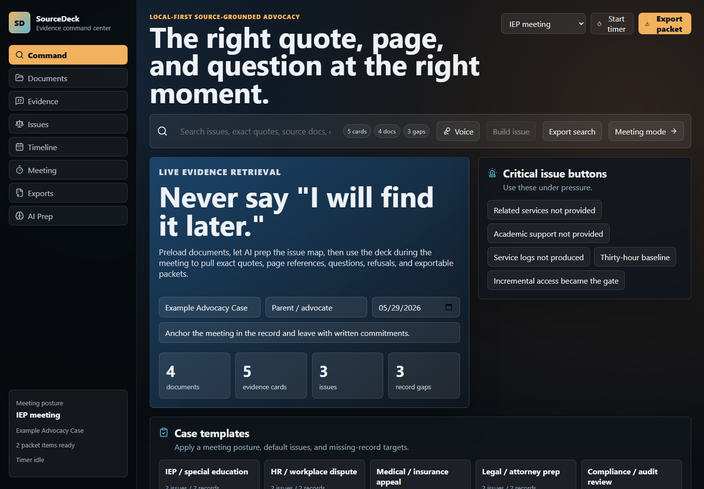
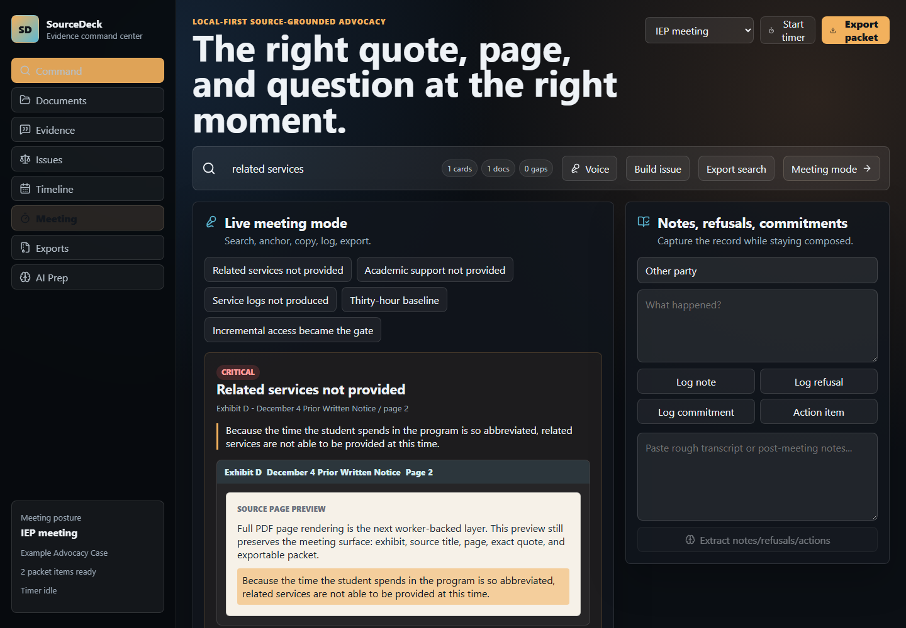
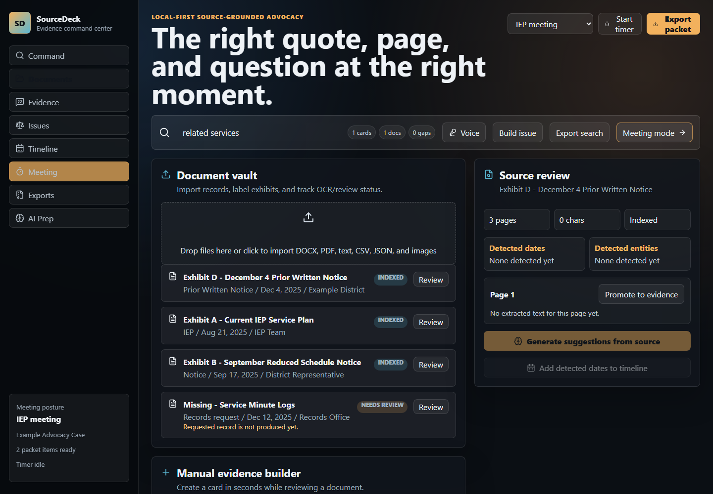
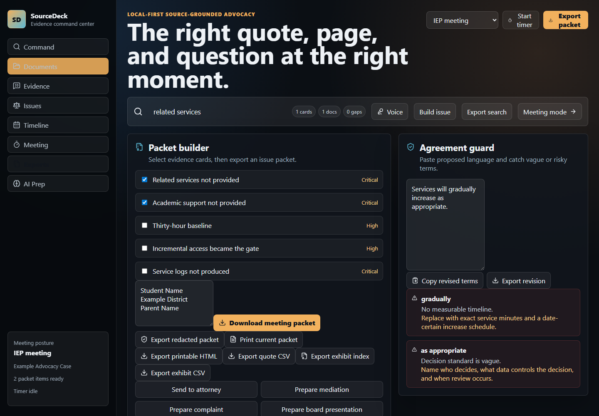

# SourceDeck

SourceDeck is a local-first evidence command center for high-stakes meetings.
It turns PDFs, Word documents, notes, and record folders into searchable
evidence cards with exact quotes, source references, issue maps, meeting
questions, missing-record trackers, and exportable packets.

Live demo: [https://sourcedeck.vercel.app](https://sourcedeck.vercel.app)

> The right quote, the right page, the right moment.

## Why This Exists

Important meetings often turn on records: IEP meetings, legal prep, HR disputes,
medical appeals, insurance reviews, compliance audits, and investigations.
People may know the evidence exists, but still lose leverage because they cannot
find the exact quote, page, or document fast enough.

SourceDeck is built around one principle:

> Never say "I will find it later."

The user can preload records, organize the issues, enter live meeting mode, and
pull up the source-backed quote or question while the conversation is happening.

## Screenshots

### Command Center



### Live Meeting Mode



### Document Vault



### Export Workspace



## Current Capabilities

- Local document vault with DOCX, PDF, text, CSV, JSON, image, and legacy DOC
  handling.
- Browser-side DOCX extraction through Mammoth.
- Browser-side PDF text extraction through PDF.js.
- Local Node case-folder preloader for private folders and legacy `.doc` files.
- Evidence cards with quote, source, exhibit, page, meaning, strategic use,
  likely defense, counter-response, tags, priority, and confidence.
- Search across evidence cards, source document text, detected dates/entities,
  and missing-record rows.
- Issue maps, contradiction map, timeline, document completeness score, and
  source-integrity audit.
- Live meeting mode with critical issue buttons, quote copy, question copy,
  refusal logging, commitment logging, action items, transcript companion, and
  source-grounded response composer.
- Case templates for IEP/special education, HR, medical/insurance, legal,
  compliance, and audit workflows.
- Agreement guard that flags vague or risky terms and generates cleaner
  replacement language.
- Export tools for Markdown packets, printable HTML, CSV quote indexes, exhibit
  indexes, missing-record requests, remedy plans, meeting briefs, redacted
  packets, and encrypted workspace JSON.
- Local-first privacy posture: sensitive records are processed locally and are
  not committed to this repository.

## Case Folder Importer

For private record folders, SourceDeck includes a local importer that builds a
workspace JSON without uploading files to a server.

```powershell
npm run case:import -- "C:\Example Case Folder"
```

The importer writes these files into the selected folder:

- `sourcedeck-workspace.json`
- `sourcedeck-pressure-test-report.md`

The generated workspace can be imported from SourceDeck's export screen. Private
case exports are ignored by git and should not be committed.

The importer currently extracts:

- `.docx` files through Mammoth
- legacy `.doc` files through `word-extractor`
- text-based PDFs through PDF.js
- text-like files such as `.txt`, `.md`, and `.csv`

Image-only PDFs, chart-only DOCX files, and scanned records are marked as
`Needs OCR` so the user knows they are not quote-searchable yet.

## Architecture

- React 19
- TypeScript
- Vite
- PDF.js for PDF text extraction
- Mammoth for DOCX extraction
- `word-extractor` for local legacy DOC preloading
- Browser localStorage for the current workspace prototype
- Web Crypto PBKDF2/AES-GCM for encrypted workspace export/import
- Vercel deployment

## Run Locally

```powershell
npm install
npm run dev
```

Build:

```powershell
npm run build
```

Lint:

```powershell
npm run lint
```

## Roadmap

- OCR worker for scanned PDFs and image-only DOCX/chart files.
- True highlighted PDF/page export with source-page overlays.
- Human-confirmed page anchors for Word imports, because raw DOCX extraction
  does not preserve original page layout.
- Durable encrypted local database instead of browser localStorage.
- Guided case-prep workflow for first-time users.
- AI provider layer for stronger evidence extraction, contradiction detection,
  likely defenses, and source-grounded meeting prep.
- Collaboration/export workflow for attorney review, mediation packets, and
  post-meeting follow-up packets.

## Privacy Note

The sample data in the demo is fictionalized. Do not commit real education,
medical, HR, legal, custody, disability, or private advocacy records to a public
repository. SourceDeck's product direction is local-first because the target
documents are often sensitive.

## Product Rule

AI can prepare the deck, organize issues, suggest evidence cards, draft clean
questions, detect contradictions, and retrieve quotes live. The human remains in
control of what gets used in the meeting, but the AI is not artificially blocked
from doing useful work.
