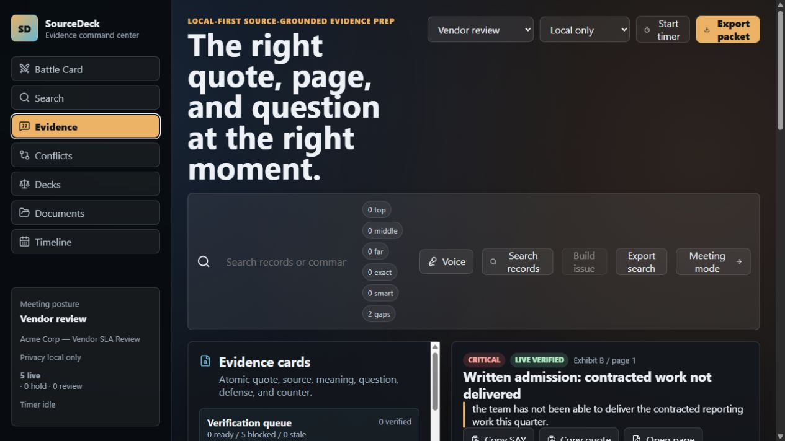
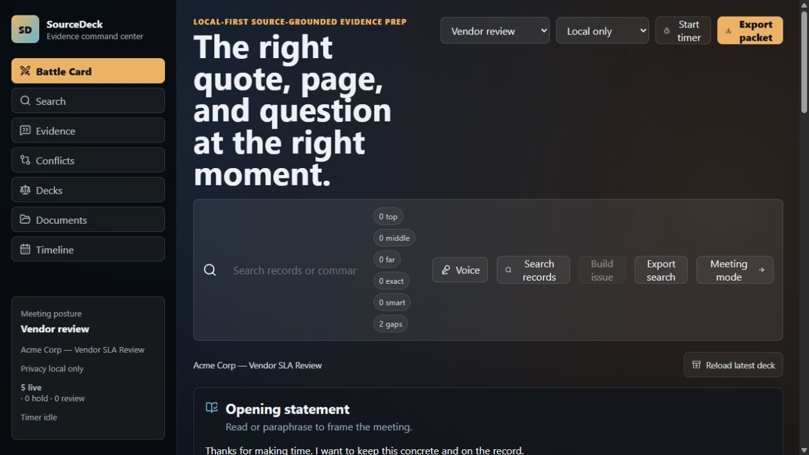
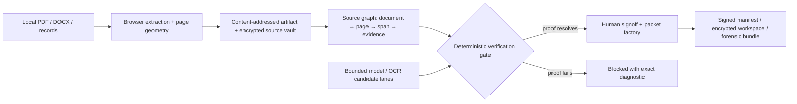

# SourceDeck

[](https://github.com/Xyloth/SourceDeck/actions/workflows/ci.yml)
[](https://sourcedeck.vercel.app)
[](TRUST_MODEL.md)

**A local-first evidence command center for high-stakes meetings.** SourceDeck turns
PDFs, Word documents, notes, and record folders into source-linked evidence cards,
issue maps, live retrieval, and exportable packets—while deterministic gates keep
unsupported claims out of the strongest path.

[](https://sourcedeck.vercel.app)

**[Open the live worked example](https://sourcedeck.vercel.app)** ·
**[Read the explicit trust model](TRUST_MODEL.md)** ·
**[Inspect the 63-case adversarial gauntlet](reports/source-gauntlet-report.md)**

## What This Repository Demonstrates

- **Document engineering:** real browser-side PDF.js and Mammoth extraction,
  page-aware source records, rendered PDF page geometry, and encrypted source-byte
  custody.
- **Deterministic trust boundaries:** exact-quote resolution, content addressing,
  append-only hash chains, signed packet manifests, redaction hard walls, and
  fail-closed packet assembly.
- **Bounded AI architecture:** source text is treated as hostile data, model output
  can propose candidates but cannot create verified facts, and privacy mode is a
  hard routing ceiling.
- **Adversarial validation:** 90 unit/security tests, a 63-case evidence gauntlet,
  and a production-browser critical-path test.
- **Secure local integration:** optional speech and CLI-intelligence sidecars bind
  to loopback, reject arbitrary browser origins, and require per-process bearer
  capabilities.
- **Shipping discipline:** locked dependencies, zero current npm advisories,
  automated lint/test/build/browser/audit CI, a live Vercel deployment, and an
  explicit list of what the system does **not** yet guarantee.

## Product Walkthrough

SourceDeck is designed for the moment when a meeting moves faster than a folder
tree. The worked example opens with a meeting battle card, lets the user retrieve
the precise supporting record, and blocks packet export when source proof is
insufficient.



The main workflow supports:

1. Import records locally and index text, pages, metadata, and custody hashes.
2. Search exact and fuzzy retrieval lanes without merging their confidence levels.
3. Turn findings into evidence cards with quote, source, page, meaning, question,
   likely defense, and counter-response.
4. Review source-chain diagnostics and human verification state.
5. Assemble Markdown, HTML, CSV, encrypted workspace, or signed forensic outputs;
   packet hard walls fail the complete export when selected claims are unresolved.
6. Enter live meeting mode for rapid quote, question, refusal, commitment, and
   action-item capture.

## System Design


```mermaid
flowchart LR
    A[Local PDF / DOCX / records] --> B[Browser extraction + page geometry]
    B --> C[Content-addressed artifact + encrypted source vault]
    C --> D[Source graph: document → page → span → evidence]
    D --> E{Deterministic verification gate}
    F[Bounded model / OCR candidate lanes] --> E
    E -->|proof resolves| G[Human signoff + packet factory]
    E -->|proof fails| H[Blocked with exact diagnostic]
    G --> I[Signed manifest / encrypted workspace / forensic bundle]
```

The kernel owns factual truth. Intelligence lanes may rank, extract, or suggest,
but no model result becomes verified evidence until its quote and source chain
resolve deterministically.

## Verifiable Engineering Evidence

| Control | Current proof |
| --- | --- |
| Unit and contract behavior | `npm test`: 87 Vitest cases + 3 Node sidecar-security cases |
| Adversarial evidence behavior | [`reports/source-gauntlet-report.md`](reports/source-gauntlet-report.md): 63/63 cases pass |
| Browser critical path | `npm run test:e2e`: Chromium navigation, record search, and textless document persistence |
| Production bundle | `npm run build`: TypeScript project build + Vite production bundle |
| Dependency posture | `npm audit`: 0 current vulnerabilities |
| Continuous verification | [GitHub Actions](https://github.com/Xyloth/SourceDeck/actions/workflows/ci.yml) runs lint, tests, build, Chromium smoke, and production audit |
| Deployment | [sourcedeck.vercel.app](https://sourcedeck.vercel.app) |

Run the same evidence locally:

```powershell
npm ci
npm run lint
npm test
npm run build
npx playwright install chromium
npm run test:e2e
npm run gauntlet:report
npm audit
```

## Current Capabilities

- DOCX, PDF, text, CSV, JSON, image, and legacy DOC handling.
- Browser PDF extraction through PDF.js and DOCX extraction through Mammoth.
- Local Node case-folder preloader for private folders and legacy `.doc` files.
- Search across evidence, source text, detected dates/entities, and missing records.
- Issue maps, contradiction views, timeline, completeness score, verification queue,
  and source-integrity audit.
- Case templates for vendor/SLA, HR, medical/insurance, legal, compliance, and
  audit workflows.
- Agreement guard for vague or risky language and cleaner replacement terms.
- Markdown, printable HTML, CSV, exhibit, missing-record, remedy, briefing,
  redacted, encrypted-workspace, and forensic-bundle outputs.
- ECDSA P-256 signing-key custody, independently verifiable packet manifests, and
  signer-fingerprint pinning.
- Local-first privacy controls: original bytes and rendered page images can be
  encrypted in IndexedDB; verbatim extracted text is session-only and removed
  before browser `localStorage` serialization.

## Run Locally

Requirements: Node.js 24 and npm.

```powershell
npm ci
npm run dev
```

The public app starts with fictional records and a complete worked example. No
private case material is committed to this repository.

## Private Case Folder Import

The local importer builds a workspace JSON beside the selected folder without
uploading files to a server:

```powershell
npm run case:import -- "C:\Example Case Folder"
```

It extracts `.docx`, legacy `.doc`, text-based `.pdf`, `.txt`, `.md`, and `.csv`.
Image-only PDFs and chart-only documents are marked `Needs OCR`; the importer does
not pretend those records are quote-searchable.

The generated files are:

- `sourcedeck-workspace.json`
- `sourcedeck-pressure-test-report.md`

Private case exports are gitignored and should never be committed.

## Local Sidecar Security

The optional speech and CLI-intelligence sidecars bind to `127.0.0.1`. Browser
operations accept only the shipped SourceDeck origin or loopback development and
Electron origins, then require a per-process capability. Wildcard CORS is not
used. Additional exact origins can be configured through
`SOURCEDECK_ALLOWED_ORIGINS`; see [`.env.example`](.env.example).

These controls prevent an unrelated webpage from invoking a local model command
or reading its output. They are a browser boundary, not an operating-system
sandbox: processes running as the same local user remain inside the local trust
boundary.

## Honest Current Boundaries

SourceDeck intentionally documents its unfinished edges:

- No live frontier-model runtime or OCR worker is wired in yet; those lanes are
  typed and gated scaffolding.
- Re-anchoring is primarily lexical, not full semantic/geometric relocation.
- Signer trust is local/manual; there is no third-party key directory.
- There is no collaboration, sync, account system, or multi-tenant backend.
- Derived fields such as evidence-card quotes and meeting notes still use
  plaintext browser `localStorage`; use a trusted browser profile and encrypted
  export for durable private custody.
- SourceDeck organizes a user's records and does not provide legal advice.

See [`TRUST_MODEL.md`](TRUST_MODEL.md) for the guarantee-by-guarantee boundary and
the conditions under which a packet must be treated as unverified.

## Roadmap

- Real OCR worker with page-image review and human-confirmed anchors.
- Full-workspace encrypted persistence rather than derived-field `localStorage`.
- Semantic and structural re-anchoring with relocation diagnostics.
- Controlled collaboration and independently reviewable trust exchange.
- Production model connectors that remain subordinate to the deterministic
  source and privacy gates.

## Product Rule

AI can prepare the deck, organize issues, suggest evidence cards, draft clean
questions, detect contradictions, and retrieve quotes live. The human remains in
control of what gets used in the meeting, and the deterministic kernel remains in
control of what can be called verified.
